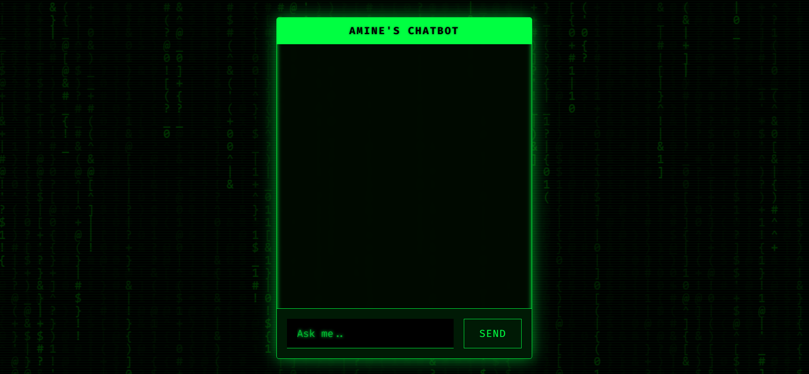
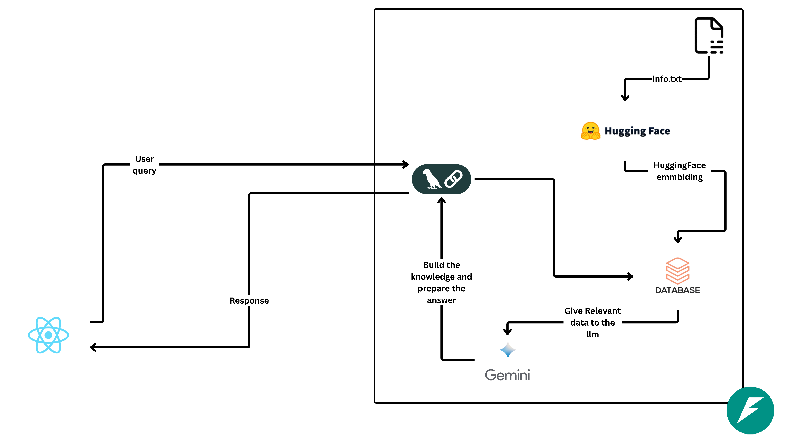

# Amine's AI Chatbot with RAG

This project is a fully functional, containerized chatbot application that leverages the power of **Retrieval-Augmented Generation (RAG)**. It provides an interactive web interface where users can ask questions and receive intelligent, context-aware answers based on a specific knowledge base about Amine.

The entire application is built with a modern, production-ready tech stack, featuring a containerized **React/Vite** frontend served by a **Node.js** server, and a **Python/FastAPI** backend, all orchestrated seamlessly with **Docker Compose**.

---

## 🖼️ Project Showcase



---
## structure


## ✨ Key Features

- **Retrieval-Augmented Generation (RAG):** The chatbot retrieves relevant information from a custom knowledge base (`rag_text_info.txt`) to provide accurate and context-specific answers about Amine.
- **Interactive Chat Interface:** A sleek, responsive frontend built with **React** and **Vite**, featuring a cool "Matrix" style background effect.
- **Decoupled & Containerized Architecture:** Both the frontend and backend run in their own isolated Docker containers, allowing for independent development, scaling, and a consistent production-like environment.
- **High-Performance Backend:** The API is built with **FastAPI**, providing a fast, asynchronous server to handle chat requests efficiently.
- **One-Command Setup:** The entire application stack is managed by **Docker Compose**, allowing you to get everything running with a single command.
- **Customizable Knowledge:** Simply edit the `rag_text_info.txt` file to update or expand the chatbot's knowledge base instantly.

---

## 🏛️ Architecture

The application follows a robust client-server model, with each part running in its own container:

1. The **User** interacts with the **React Frontend**. The production-ready static files are served by a lightweight **Node.js server** running inside a container based on the `node:alpine` image.
2. The frontend sends the user's query to the **FastAPI Backend** container's API endpoint.
3. The backend's RAG logic retrieves the most relevant context from the **Knowledge Base** (`rag_text_info.txt`).
4. The context and the user's query are sent to a **Large Language Model (LLM)** via an API call.
5. The LLM generates a response, which is sent back through the API to the frontend and displayed to the user.

---

## 🛠️ Tech Stack

| Component               | Technology                                                                                                                                                                                                                                                                                                                 |
| ----------------------- | -------------------------------------------------------------------------------------------------------------------------------------------------------------------------------------------------------------------------------------------------------------------------------------------------------------------------- |
| **Frontend**      |    *(for serving)* |
| **Backend**       |                                                                                                                   |
| **Orchestration** |                                                                                                                                                                                                                         |

---

## 📁 Project Structure

```
.
├── chatbot/                    # Python FastAPI Backend Service
│   ├── app.py                  # Main FastAPI application
│   ├── chat_bot_logic.py       # Core RAG logic and LLM interaction
│   ├── rag_text_info.txt       # The knowledge base for the chatbot
│   ├── Dockerfile              # Docker instructions for the backend
│   └── requirements.txt        # Python dependencies
│
├── chatbot-front/              # React/Vite Frontend Service
│   ├── src/                    # React components and application logic
│   ├── Dockerfile              # Docker instructions for building and serving the frontend
│   ├── index.html              # Main HTML entry point
│   └── package.json            # Node.js dependencies
│
├── .gitignore                  # Global git ignore rules
├── docker-compose.yml          # Main Docker Compose file to orchestrate services
└── image.png                   # Screenshot for the README
```

---

## 🚀 Getting Started

Follow these instructions to get the project up and running on your local machine.

### Prerequisites

- [Git](https://git-scm.com/)
- [Docker](https://www.docker.com/products/docker-desktop/)
- [Docker Compose](https://docs.docker.com/compose/) (included with Docker Desktop)

### Installation & Setup

1. **Clone the repository:**

   ```bash
   git clone https://github.com/amineelgardoum-rgb/Rag_amine_chatbot.git
   cd Rag_amine_chatbot
   ```
2. **Set up Backend Environment Variables (Crucial Step):**
   The backend needs an API key to connect to a Large Language Model (e.g., OpenAI, Hugging Face, etc.).

   - Navigate to the `chatbot` directory: `cd chatbot`
   - Create a new file named `.env`: `touch .env`
   - Open the `.env` file and add your API key. For example:
     ```env
     GOOGLE_GEMINI_API_KEY="YourSecretApiKeyGoesHere"
     ```
   - **Important:** Return to the root directory before running docker-compose: `cd ..`
3. **Customize the Knowledge Base (Optional):**
   Open `chatbot/rag_text_info.txt` and add or modify the text content. This is the information the chatbot will use to answer questions about Amine.

### Running the Application

Launch the entire application stack with a single command from the root directory:

```bash
docker-compose up --build -d
```

- `--build`: Builds the Docker images for both the frontend and backend if they don't exist or have changed.
- `-d`: Runs the containers in detached mode (in the background).

To check if the services are running correctly:

```bash
docker-compose ps
```

### Accessing the Application

- **Frontend (Chat Interface):** Open your browser and navigate to **[http://localhost:5173](http://localhost:5173)** (or whichever port you've mapped for the frontend in `docker-compose.yml`).
- **Backend (API Docs):** The API documentation is available at **[http://localhost:8000/docs](http://localhost:8000/docs)**.

---

## 🛑 Stopping the Services

To stop and remove all the running containers:

```bash
docker-compose down
```

To also remove the associated volumes (if any were configured):

```bash
docker-compose down -v
```
